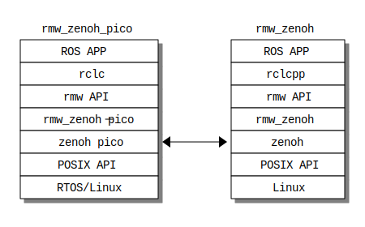
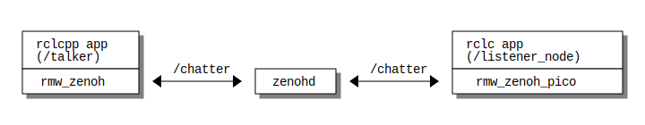

# RMW zenoh-pico implementation

[](https://opensource.org/licenses/Apache-2.0)

## Overview

The rmw_zenoh_pico is the implementation of the rmw layer with zenoh_pico.
This package is generated using the [Micro-ROS project](https://micro.ros.org/) stack.

This package provides the same future as the [RMW Micro XRCE-DDS implementation](https://github.com/micro-ROS/rmw_microxrcedds).

This package is able to connect the [rmw_zenoh](https://github.com/ros2/rmw_zenoh) layer, whose implementation is based on Zenoh and is written using the zenoh-c bindings by the ROS community.



## Packages

### What is rmw_zenoh_pico ?

- Implementation of the ROS 2 middleware abstraction interface written by C  
- Generate micro-ROS applications using zenoh-pico  
- A middleware implementation for [zenoh-pico](https://github.com/eclipse-zenoh/zenoh-pico) package  
- Replacement XRCE-DDS on micro-ROS with zenoh-pico  
- Wrapper of zenoh-pico API and zenoh-pico internal utilities(z_sting, z_mutex, etc.)  
- The reference library implementation for the Zenoh protocol used from upper layers in the ROS 2 stack  

### Configuration

This package can be configured via CMake arguments.

| Name                            | Description                                                  | Default      | Config |
|---------------------------------|--------------------------------------------------------------|--------------|--------|
| RMW_ZENOH_PICO_TRANSPORT        | Sets zenoh-pico transport to use (unicast, serial)           | unicast      | OK     |
| RMW_ZENOH_PICO_TRANSPORT_MODE   | Sets Zenoh transport connection mode                         | client       | OK     |
| RMW_ZENOH_PICO_CONNECT          | Sets the scout address.                                      | 127.0.0.1    | OK     |
| RMW_ZENOH_PICO_CONNECT_PORT     | Sets the scout port.                                         | 7447         | OK     |
| RMW_ZENOH_PICO_LISTEN           | Sets the listen address.                                     | 127.0.0.1    |        |
| RMW_ZENOH_PICO_LISTEN_PORT      | Sets the listen port.                                        | -1           |        |
| RMW_ZENOH_PICO_SERIAL_DEVICE    | Sets the agent serial port.                                  | /dev/ttyAMA0 | OK     |
| RMW_ZENOH_PICO_SERIAL_DEVICE    | Sets the agent serial port.*1                                | /dev/ttyAMA0 | OK     |
| RMW_ZENOH_PICO_MAX_LINENESS_LEN | This value sets the number of max liveliness resource length | 256          |        |
| RMW_ZENOH_PICO_C_STANDARD       | Version of the C language used to build the library          | 99           |        |

*1 Will be supported in the future

## Support rmw Functions

The rmw API for rmw_zenoh_pico is not currently as well supported as rmw_zenoh and rmw_microxrcedds_c.
This [list](./rmw_zenoh_pico_rmw_list.md) is support of rmw_zenoh_pico.

> [!IMPORTANT]
> The prototype implementation of rmw_zenoh_pico does not yet support graph information (gid).  
> Therefore, this implementation only supports pub/sub connections. Other connection types (server/client, node information, etc.) are not yet supported.  
>
> For rmw_zenoh_pico to support gid, several [issues](#known-issueslimitations) should be considered.   
> The rmw_zenoh_pico would like to support zenoh_pico and rmw_zenoh along with future updates from the ROS community.  

## Installing and build for rmw_zenoh_pico with the micro-ROS system

The rmw_zenoh_pico is used instead of the XRCE-DDS layer in the micro-ROS product.  
The rmw_zenoh_pico has to install the micro-ROS product before building it.  
For example, if you want to generate a host environment for rmw_zenoh_pico, please refer to the [first_application_linux](https://micro.ros.org/docs/tutorials/core/first_application_linux/) document to install the host environment.  

Table: Related repositories

| Repository      | Branch         | SID                                      | URL                                             |
|-----------------|----------------|------------------------------------------|-------------------------------------------------|
| micro_ros_setup | jazzy          | 9ae1ca79ca3cb5f8fbd3867d02a6e43686388f05 | <https://github.com/micro-ROS/micro_ros_setup>    |
| zenoh-c         | release/0.11.0 | c8f6ca07f77d684a0ce4a8b31eae4c4a11c9bb58 | <https://github.com/eclipse-zenoh/zenoh-c.git>    |
| zenoh-pico      | release/0.11.0 | a3ab7f79617c0076693852e68e75a50053463ae4 | <https://github.com/eclipse-zenoh/zenoh-pico.git> |
| rmw_zenoh       | rolling        | 011cc79f564f7f4ab0e47e1604062c14c355546a | <https://github.com/ros2/rmw_zenoh.git>           |
| zenoh           | main           | 2500e5a62d8940cbfbc36f27c07360f91ba28c2d | <https://github.com/eclipse-zenoh/zenoh.git>      |

### Create a workspace and download the micro-ROS tools

``` bash
unset RMW_IMPLEMENTATION 
mkdir uros_ws && cd uros_ws
git clone -b rmw_zenoh_pico https://github.com/esol-community/micro_ros_setup src/micro_ros_setup
rosdep update && rosdep install --from-paths src --ignore-src -y
colcon build
```

> [!NOTE]
>
> 1. The rmw_zenoh_pico need part of any library which is used by get hash value in the fastdds library.
>    Therefore, the value of RMW_IMPLEMENTATION should not be set before building rmw_zenoh_pico if you use customize rmw_middleware (ex. cyclonedds).
> 2. The rmw_zenoh_pico have to add patch to product of micro_ros_setup.
>    If you need the patched product, you can clone the branch of rmw_zenoh_pico from [mirror of micro_ros_setup](https://github.com/esol-community/micro_ros_setup).

## Creating a new firmware workspace

The rmw_zenoh_pico has demo programs.  
This section introduces a sample communication example between rmw_zenoh_pico and zenoh_pico.

Target connection summary:



Target environments:  

| Target                                      | IP address |
|---------------------------------------------|------------|
| Linux target (local connect) / zenohd       | localhost  |
| Linux target (external connection) / zenohd | 10.0.30.10 |
| Raspberry-pi target                         | 10.0.30.50 |

| Type of rmw    | ROS application name | Node name      |
|----------------|----------------------|----------------|
| rmw_zenoh      | talker               | /talker        |
| rmw_zenoh_pico | listener             | /listener_node |

| use token |
|-----------|
| /chatter  |

### Build Linux target

``` bash
# cd uros_ws
source install/local_setup.bash
ros2 run micro_ros_setup create_firmware_ws.sh zenoh host
source install/local_setup.bash
ros2 run micro_ros_setup build_firmware.sh
file ./install/rmw_zenoh_pico/lib/rmw_zenoh_demos_rclc/listener/listener
# ./install/rmw_zenoh_pico/lib/rmw_zenoh_demos_rclc/listener/listener: ELF 64-bit LSB pie executable, x86-64, version 1 (SYSV), dynamically linked, interpreter /lib64/ld-linux-x86-64.so.2, BuildID[sha1]=2c0119cf4620f58fafa736594d3bba038e56e13a, for GNU/Linux 3.2.0, not stripped
```

### Build Raspberry Pi target

``` bash
# cd uros_ws
source install/local_setup.bash
ros2 run micro_ros_setup create_firmware_ws.sh zenoh raspbian bookworm_v12
ros2 run micro_ros_setup configure_firmware.sh listener -t unicast -i <zenohd ip> -p <zenohd port>
source install/local_setup.bash
ros2 run micro_ros_setup build_firmware.sh
file ./firmware/bin/listener
# ./firmware/bin/listener: ELF 32-bit LSB executable, ARM, EABI5 version 1 (SYSV), dynamically linked, interpreter /lib/ld-linux-armhf.so.3, for GNU/Linux 3.2.0, with debug_info, not stripped
```

The zenoh_pico in rmw_zenoh_pico is executing in client mode, and the connection has to be set to zenoh/zenohd.  
The Raspberry Pi OS configuration for rmw_zenoh_pico has to set their IP address and port when executing configure_firmware.  

| Name       | Mean                         | Example       |
|------------|------------------------------|---------------|
| zenoh ip   | address connect zenoh/zenohd | -i 10.0.30.10 |
| zenoh port | port connect zenoh           | -p 7447       |

The Raspberry Pi OS configuration on this patch on the rmw_zeno_pico package used Raspberry Pi 1 and Raspberry Pi Pico toolchains (ELF32bit/EABI5).  
If you want to use another Raspberry Pi target, which is a 64-bit environment, you have to change part of the toolchain URL in create.sh manually.  

```console
$ cat micro_ros_setup/config/zenoh/raspbian/create.sh 
#! /bin/bash

pushd $FW_TARGETDIR/$DEV_WS_DIR >/dev/null
    if [ $OPTION == "bookworm_v12" ]; then
        TOOLCHAIN_URL="https://..."              /* Change URL of cross-compile toolchain */
                                                 /* For match target Raspberry Pi OS environment */
    else
        echo "Platform not supported."
        exit 1
    fi
       :
```

See: <https://sourceforge.net/projects/raspberry-pi-cross-compilers/files/Raspberry%20Pi%20GCC%20Cross-Compiler%20Toolchains/>  

### Build RTOS target

T.D.B

## Running the micro-ROS app

For sample details, see [Setup](https://github.com/ros2/rmw_zenoh#setup) in the rmw_zenoh repository.

### Running common service on Linux  

The following commands are executed on another terminal, respectively.

1. Start the Zenoh router on rmw_zenoh

    ``` bash
    # cd <directory in install rmw_zenoh> 
    source install/setup.bash
    ros2 run rmw_zenoh_cpp rmw_zenohd
    ```

2. Run the talker on rmw_zenoh

    ``` bash
    # cd <directory in install rmw_zenoh> 
    sudo apt-get install ros-$ROS_DISTRO-demo-nodes-py
    sudo apt-get install ros-$ROS_DISTRO-demo-nodes-cpp
    source /opt/ros/$ROS_DISTRO/local_setup.bash
    source install/setup.bash
    export RMW_IMPLEMENTATION=rmw_zenoh_cpp
    ros2 run demo_nodes_cpp talker
    ``` 

### Running Linux target

1. Run the listener on rmw_zenoh_pico in microros

    ``` bash
    # cd uros_ws
    source install/local_setup.bash
    export RMW_IMPLEMENTATION=rmw_zenoh_pico
    ros2 run rmw_zenoh_demos_rclc listener
    ``` 

### Running Raspberry Pi target (on Raspberry Pi H/W)

1. Copy the micro-ROS application to Raspberry Pi

    ``` bash
    # cd uros_ws
    scp firmware/bin/listener <target raspberry pi>:~/.
    ```

2. Listen application

    ```bash
    ssh <target raspberry pi>
    ./listener
    ```

### Running RTOS target

T.D.B

### Name of node/topic on ROS 2 (option)

The ROS 2 CLI command starts a new ROS 2 daemon task, and the daemon caches data.  
If the ROS 2 daemon is already running, it must be stopped before executing ROS 2 CLI commands. 

1. Get the node name if the listener node is executed

    ``` bash
    ros2 daemon stop
    # The daemon has been stopped
    source install/setup.bash
    export RMW_IMPLEMENTATION=rmw_zenoh_cpp
    ros2 node list
    # [INFO] [1728446929.812251213] [rmw_zenoh_cpp]: Successfully connected to a Zenoh router with id aebe653d2ff57b4ba1ef7b43c59b547.
    # [WARN] [1728446931.353213030] [rmw_zenoh_cpp]: Received liveliness token to remove node /_ros2cli_361692 from the graph before all pub/subs/clients/services for this node have been removed. Removing all entities first...
    # /listener_node
    ```

2. Get the topic name if the listener node is executed

    ``` bash
    ros2 daemon stop
    # The daemon has been stopped
    source install/setup.bash
    export RMW_IMPLEMENTATION=rmw_zenoh_cpp
    ros2 topic list
    # [INFO] [1728446957.797293950] [rmw_zenoh_cpp]: Successfully connected to a Zenoh router with id aebe653d2ff57b4ba1ef7b43c59b547.
    # [WARN] [1728446959.338124246] [rmw_zenoh_cpp]: Received liveliness token to remove node /_ros2cli_361735 from the graph before all pub/subs/clients/services for this node have been removed. Removing all entities first...
    # /parameter_events
    # /rosout
    # /chatter
    ```

The new ROS 2 daemon started by ROS 2 CLI exits when this command exits.  
At this time, the rmw_zenoh middleware outputs a few messages.
This message will change depending on your build/execute environment.  

## Purpose of the Project

This software is not ready for production use.
It has neither been developed nor tested for a specific use case.  
However, the license conditions of the applicable open-source licenses allow you to adapt the software to your needs.
Before using it in a safety-relevant setting, ensure the software fulfills your requirements and adjusts them according to applicable safety standards, e.g., ISO 26262.

## License

This repository is open-sourced under the Apache-2.0 license. See the [LICENSE](LICENSE) file for details.

For a list of other open-source components included in this repository, see the file [3rd-party-licenses.txt](3rd-party-licenses.txt).

## Known Issues/Limitations

1. The pub/sub message from rmw_zenoh_pico does not use attempt data.  
The rmw_zenoh is using Zenoh package, and the message from rmw_zenoh append additional data on future attempts with Zenoh.  
The additional data on rmw_zenoh is "gid", "sequence_number" and "source_timestamp".  
The rmw_zenoh_pico is using zenoh pico package. However, the rmw_zenoh_pico with zenoh-pico cannot exchange the attempt data.  
Therefore, rmw_zenoh_pico does not yet support the full RMW API except for working communication between subscribers and publishers.

1. How to share liveliness information data.  
The rmw_zenoh pico can use some ROS 2 CLI commands. However, this implementation is provisional.  
The rmw_zenoh is controlled by liveliness information, which generates keyexpr data by `z_declare_keyexpr()`.
And their information saves resource data in each internal memory.  
The rmw_zenoh is executed in the Zenoh P2P mode. This P2P mode can be exchanged when a Zenoh peer connects to another peer.  
Conversely, rmw_zenoh_pico connects to the Zenoh network in client mode.
The zenohd does not forward keyexpr data. In client mode, there is no way to exchange internal resource keyexpr data with other peers because no P2P connection is performed.  
Currently, the rmw_zenoh_pico works around this problem by creating a new subscribe key for liveliness information. This new subscribe key is used only in the future.  
We feel that this implementation is not very suitable for poor MPCs and upper-layer applications. And if we find a more effective way to approach this issue, we will need to change this implementation.  

1. The rmw_zenoh_pico using malloc() system futures when there is a new memory region.  
The XRCE-DDS implementation has simple memory futures in its layer.
This memory future is designed to run ROS 2 communication for small resource systems.  
The rmw_zenoh layer can execute on a Linux system with a memory subsystem for a large system with Zenoh.  
The zenoh-pico is designed for small resource systems.  
However, the zenoh-pico memory is compiling into its system, and it is not designed to use the same data area with an upside layer, which is rmw_zenoh_pico.  
If you use rmw_zeno_pico on a small resource system with any RTOS, you might need to add some customizations for zenoh-pico and rmw_zenoh_pico.
