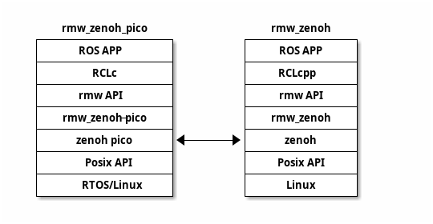

# RMW zenoh-pico implementation

[](https://opensource.org/licenses/Apache-2.0)

## Overview
The rmw_zenoh_pico is implementation of rmw layer with zenoh_pico.
This package is generated as part of [Micro-ROS project](https://micro.ros.org/) stack.

This package provides the same future as the [RMW Micro XRCE-DDS implementation](https://github.com/micro-ROS/rmw_microxrcedds).

This package is able to connect [rmw_zenoh](https://github.com/ros2/rmw_zenoh) layer which implementation based on Zenoh that is written using the zenoh-c bindings by ros community.



## Packages

### rmw_zenoh-pico
like RMW Micro XRCE-DDS, This layer is the ROS 2 Middleware Abstraction Interface written in C.This package provides a middleware implementation for [zenho-pico](https://github.com/eclipse-zenoh/zenoh-pico) package.

The implementation wraps from zenoh-pico api and zenoh-pico internal utilities(z_sting, z_mutex,,,). This library defines the interface used by upper layers in the ROS 2 stack, and that is implemented using zenoh protocol.

#### configuration
this package can be configred via CMake arguments.

| Name                            | Description                                                  | Default      |
|---------------------------------|--------------------------------------------------------------|--------------|
| RMW_ZENOH_PICO_TRANSPORT        | Sets zenoh pico transport to use. (unicast , serial)         | unicast      |
| RMW_ZENOH_PICO_TRANSPORT_MODE   | zenoh transport connect mode                                 | client       |
| RMW_ZENOH_PICO_CONNECT          | Sets the scout address.                                      | 127.0.0.1    |
| RMW_ZENOH_PICO_CONNECT_PORT     | Sets the scout port.                                         | 7447         |
| RMW_ZENOH_PICO_LISTEN           | Sets the listen address.                                     | 127.0.0.1    |
| RMW_ZENOH_PICO_LISTEN_PORT      | Sets the listen port.                                        | -1           |
| RMW_ZENOH_PICO_LOCATOR          | Sets the scout address by mcast.                             | 224.0.0.224  |
| RMW_ZENOH_PICO_LOCATOR_PORT     | Sets the scout port by mcast.                                | 7446         |
| RMW_ZENOH_PICO_SERIAL_DEVICE    | Sets the agent serial port.                                  | /dev/ttyAMA0 |
| RMW_ZENOH_PICO_MAX_LINENESS_LEN | This value sets the number of max liveliness resource length | 256          |
| RMW_ZENOH_PICO_C_STANDARD       | Version of the C language used to build the library          | 99           |

## Support rmw Functions

The support number of rmw api in rmw_zenoh_pico is less than number rmw_zenoh and rmw_microxrcedds_c, yet.
this [list](./rmw_zenoh_pico_rmw_list.md) is support of rmw_zenoh_pico.

## Installing ROS 2 and the micro-ROS build system

The rmw_zenoh_pico is used instead of the XRCE-DDS layer in the micro-ros product.
so, The rmw_zenoh_pico have to install microros product before build its. 
for example, if you want to generate a host environment for rmw_zenoh_pico, please refer to the [first_application_linux](https://micro.ros.org/docs/tutorials/core/first_application_linux/) document to install the host environment.

### Create a workspace and download the micro-ROS tools 

``` 
% mkdir -p microros
% pushd microros
% popd 
```

the branch of rmw_zenoh_pico on this URL is append config of host_zenoh.
this host_zenoh configuration use rmw_zenoh_pico package.

if you want use the private micro_ros_setup, you are using this [pactch](extern/patches/micro_ros_setup/0001-import-host_zenoh-configuration.patch). 

### download rmw_zenoh_pico package

``` 
% export RMW_ZENOH_PICO_PATH="$PWD/rmw_zenoh_pico"
``` 

the host_zenoh configuration on micro_ros_setup read rmw_zenoh_pico package from path of RMW_ZENOH_PICO_PATH value.

### Update dependencies using rosdep

``` 
% sudo apt update && rosdep update
% rosdep install --from-paths src --ignore-src -y
% sudo apt-get install python3-pip
% colcon build
% source install/local_setup.bash
```
## Creating a new firmware workspace

the rmw_zenoh_pico have any demo program.
In this session, we will introduce a sample communication example between rmw_zenoh_pico and zenoh_pico.

### on Linux

```
% cd microros
% ros2 run micro_ros_setup create_firmware_ws.sh host_zenoh
```

Attention:
when you build micro ros by host zenoh, this build occor error message on terminal.

```
   :
rmw_zenoh_pico: Cannot locate rosdep definition for [zenohpico]
rosidl_typesupport_microxrcedds_test_msg: Cannot locate rosdep definition for [rmw_microxrcedds]
Continuing to install resolvable dependencies...
#All required rosdeps installed successfully
Compiling for host environment: not cleaning path
Building firmware for host_zenoh platform generic
   :
```

### on Raspberry Pi
T.D.B

### on RTOS 
T.D.B

## Running the micro-ROS app

| type of rmw    | ros application |
|----------------|-----------------|
| rmw_zenoh      | talker          |
| rmw_zenoh_pico | listener        |

For sample details, see [Test](https://github.com/ros2/rmw_zenoh#test) in rmw_zenoh.

### on Linux
the command execute on other terminal. 

1. Start the Zenoh router on rmw_zenoh

``` 
% cd <directory in install rmw_zenoh> 
% source install/setup.bash
% ros2 run rmw_zenoh_cpp rmw_zenohd
```

2. Run the talker on rmw_zenoh

``` 
% cd <directory in install rmw_zenoh> 
% source install/setup.bash
% export RMW_IMPLEMENTATION=rmw_zenoh_cpp
% ros2 run demo_nodes_cpp talker
``` 

3. Run the listener on rmw_zenoh_pico in microros

``` 
% cd <directory in install microros>
source install/local_setup.bash
export RMW_IMPLEMENTATION=rmw_zenoh_pico
ros2 run rmw_zenoh_demos_rclc listener
``` 

### on Raspberry Pi
T.D.B

### on RTOS 
T.D.B


## Purpose of the Project

This software is not ready for production use. It has neither been developed nor
tested for a specific use case. However, the license conditions of the
applicable Open Source licenses allow you to adapt the software to your needs.
Before using it in a safety relevant setting, make sure that the software
fulfills your requirements and adjust it according to any applicable safety
standards, e.g., ISO 26262.

## License

This repository is open-sourced under the Apache-2.0 license. See the [LICENSE](LICENSE) file for details.

For a list of other open-source components included in this repository,
see the file [3rd-party-licenses.txt](3rd-party-licenses.txt).

## Known Issues/Limitations/next futures

1. the rmw_zenoh_pico using malloc() system futures when there need new memory region.
the XRCE-DDS implementation have simple memory futures into own layer.  
this memory futures is designed to run ros communication for small resource system.
Now, the rmw_zenoh rayer is able to execute on linux system which have memory subsystem for large system with zenoh.  
the zenoh-pico is designed for small resource system. however, the zenoh-pico memory is compiling into own system and it is not designed to use same data area with upside layer which is rmw_zenoh_pico.  
If you use rmw_zeno_pico on a small resource system with any RTOS, you might need to add some customizations for zenoh-pico and rmw_zenoh_pico.  

1. the node infomation for rmw_zenoh_pico is not get on other node on rmw_zenoh.
first time, the rmw_zenoh get resource data which is other resource data from zenohd when the there is starting. and the rmw_zenoh generate own resource data which is used by node infomation.  
the rmw_zenoh_pico send own liveliness infomation to zenohd when there is starting. however, its data is not downloading rmw_zenoh when the rmw_zenoh is start.   
the rmw_zenoh_pico sends my liveness information to zenohd when there starts. However, that data is not downloaded to rmw_zenoh from zenohd when the rmw_zenoh starts. Now, the node list command does not work properly on the rmw_zenoh node yet.  

1. the pub/sub message from rmw_zenoh_pico do not using attempt data.
the rmw_zenoh is using zenoh package. and the message from rmw_zenoh append additional data on attempt future with zenoh. the additional data on rmw_zenoh is "gid", "sequence_number" and "source_timestamp".  
the rmw_zenoh_pico is using zenoh pico package. however, the rmw_zenoh_pico with zenoh-pico is not able to exchange the attempt data. Therefore, rmw_zenoh_pico does not yet support the full RMW API except for working communication between subscribers and publishers.  
