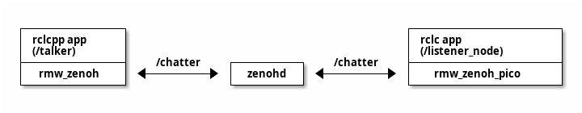

# RMW zenoh-pico implementation

[](https://opensource.org/licenses/Apache-2.0)

## Overview

The rmw_zenoh_pico is implementation of rmw layer with zenoh_pico.
This package is generated as part of [Micro-ROS project](https://micro.ros.org/) stack.

This package provides the same future as the [RMW Micro XRCE-DDS implementation](https://github.com/micro-ROS/rmw_microxrcedds).

This package is able to connect [rmw_zenoh](https://github.com/ros2/rmw_zenoh) layer which implementation based on Zenoh that is written using the zenoh-c bindings by ros community.


## Packages

### What is rmw_zenoh-pico ?

- This package is implementation of the ROS 2 Middleware Abstraction Interface written by C.  
- This package allows to generate applications using the same steps as microros product.  
- This package provides a Middleware implementation for [zenho-pico](https://github.com/eclipse-zenoh/zenoh-pico) package.  
- This package is implemented by replacing XRCE-DDS on microros with zeno-pico.  
- This package is implementation wraps from zenoh-pico api and zenoh-pico internal utilities(z_sting, z_mutex,,,).   
- This package is defines the library interface used by upper layers in the ROS 2 stack, and that is implemented using zenoh protocol.

### configuration

this package can be configred via CMake arguments.

| Name                            | Description                                                  | Default      | config |
|---------------------------------|--------------------------------------------------------------|--------------|--------|
| RMW_ZENOH_PICO_TRANSPORT        | Sets zenoh pico transport to use. (unicast , serial)         | unicast      | OK     |
| RMW_ZENOH_PICO_TRANSPORT_MODE   | zenoh transport connect mode                                 | client       | OK     |
| RMW_ZENOH_PICO_CONNECT          | Sets the scout address.                                      | 127.0.0.1    | OK     |
| RMW_ZENOH_PICO_CONNECT_PORT     | Sets the scout port.                                         | 7447         | OK     |
| RMW_ZENOH_PICO_LISTEN           | Sets the listen address.                                     | 127.0.0.1    |        |
| RMW_ZENOH_PICO_LISTEN_PORT      | Sets the listen port.                                        | -1           |        |
| RMW_ZENOH_PICO_SERIAL_DEVICE    | Sets the agent serial port.                                  | /dev/ttyAMA0 | OK     |
| RMW_ZENOH_PICO_MAX_LINENESS_LEN | This value sets the number of max liveliness resource length | 256          |        |
| RMW_ZENOH_PICO_C_STANDARD       | Version of the C language used to build the library          | 99           |        |

## Support rmw Functions

The support number of rmw api in rmw_zenoh_pico is less than number rmw_zenoh and rmw_microxrcedds_c, yet.
this [list](./rmw_zenoh_pico_rmw_list.md) is support of rmw_zenoh_pico.

ATTENTION:
The prototype implementation of rmw_zneoh_pico does not yet support graph information (gid).  
Therefore, this implementation only supports pub/sub connections. Other connection types (server/client, node information, etc.) are not supported, yet.  

In order for rmw_zenoh_pico to support gid, several [issues](#known-issueslimitations) need to be considered.   
the rmw_zenoh_pico would like to support zenoh_pico and rmw_zenoh along with updates from the ros community in the future.  

## Installing and build for rmw_zenoh_pico with the microros system

The rmw_zenoh_pico is used instead of the XRCE-DDS layer in the micro-ros product.  
so, The rmw_zenoh_pico have to install microros product before build its. 
for example, if you want to generate a host environment for rmw_zenoh_pico, please refer to the [first_application_linux](https://micro.ros.org/docs/tutorials/core/first_application_linux/) document to install the host environment.  

using other repository:

| repository      | branch         | sid                                      | url                                             |
|-----------------|----------------|------------------------------------------|-------------------------------------------------|
| micro_ros_setup | jazzy          | 9ae1ca79ca3cb5f8fbd3867d02a6e43686388f05 | https://github.com/micro-ROS/micro_ros_setup    |
| zenoh-c         | release/0.11.0 | c8f6ca07f77d684a0ce4a8b31eae4c4a11c9bb58 | https://github.com/eclipse-zenoh/zenoh-c.git    |
| zenoh-pico      | release/0.11.0 | a3ab7f79617c0076693852e68e75a50053463ae4 | https://github.com/eclipse-zenoh/zenoh-pico.git |
| rmw_zenoh       | rolling        | 011cc79f564f7f4ab0e47e1604062c14c355546a | https://github.com/ros2/rmw_zenoh.git           |
| zenoh           | main           | 2500e5a62d8940cbfbc36f27c07360f91ba28c2d | https://github.com/eclipse-zenoh/zenoh.git      |

### Download rmw_zenoh_pico package

``` console 
$ git clone <URL::rmw_zenoh_pico.git>
$ export RMW_ZENOH_PICO_PATH="$PWD/rmw_zenoh_pico"
``` 

the host_zenoh configuration on micro_ros_setup read rmw_zenoh_pico package from path of RMW_ZENOH_PICO_PATH value.

### Create a workspace and download the micro-ROS tools 

``` console
$ mkdir microros
$ pushd microros
$ git clone -b $ROS_DISTRO https://github.com/micro-ROS/micro_ros_setup.git src/micro_ros_setup
$ cd src/micro_ros_setup
$ git checkout -b rmw_zenoh_pico
$ git am $RMW_ZENOH_PICO_PATH/extern/patches/micro_ros_setup/*
$ rosdep update && rosdep install --from-paths src --ignore-src -y
$ colcon build
$ source install/local_setup.bash
$ popd
$ ls
microros  rmw_zenoh_pico
```

## Creating a new firmware workspace

The rmw_zenoh_pico have any demo program.  
In this session, we will introduce a sample communication example between rmw_zenoh_pico and zenoh_pico.

target connection summary :


target environments:  

| target                                      | ip address |
|---------------------------------------------|------------|
| linux target (local connect) / zenohd       | localhost  |
| linux target (external connection) / zenohd | 10.0.30.10 |
| rasberry-pi target                          | 10.0.30.50 |

| type of rmw    | ros application name | node name      |
|----------------|----------------------|----------------|
| rmw_zenoh      | talker               | /talker        |
| rmw_zenoh_pico | listener             | /listener_node |

| use token |
|-----------|
| /chatter  |

### build Linux target

``` console
$ pushd microros
$ ros2 run micro_ros_setup create_firmware_ws.sh zenoh host
$ source install/local_setup.bash
$ ros2 run micro_ros_setup build_firmware.sh
$ file ./install/rmw_zenoh_pico/lib/rmw_zenoh_demos_rclc/listener/listener
./install/rmw_zenoh_pico/lib/rmw_zenoh_demos_rclc/listener/listener: ELF 64-bit LSB pie executable, x86-64, version 1 (SYSV), dynamically linked, interpreter /lib64/ld-linux-x86-64.so.2, BuildID[sha1]=2c0119cf4620f58fafa736594d3bba038e56e13a, for GNU/Linux 3.2.0, not stripped
$ popd
```

### build Raspberry Pi target

``` console
$ pushd microros
$ ros2 run micro_ros_setup create_firmware_ws.sh zenoh raspbian bookworm_v12
$ ros2 run micro_ros_setup configure_firmware.sh listener -t unicast -i <zenohd ip> -p <zenohd port>
$ source install/local_setup.bash
$ ros2 run micro_ros_setup build_firmware.sh
$ file  firmware/bin/listener
firmware/bin/listener: ELF 32-bit LSB executable, ARM, EABI5 version 1 (SYSV), dynamically linked, interpreter /lib/ld-linux-armhf.so.3, for GNU/Linux 3.2.0, with debug_info, not stripped
$ popd
```

The znoh_pico in rmw_zeno_pico is executing by client mode. so the  rmw_zenoh_pico have to set connect zenoh/zenohd.  
The raspios  configration for rmw_zenoh_pico have to set their ip address and port when execute configure_firmware.  

| name       | mean                         | example       |
|------------|------------------------------|---------------|
| zenoh ip   | address connect zenoh/zenohd | -i 10.0.30.10 |
| zenoh port | port connect zenoh           | -p 7447       |

The raspios configration on this patch on rmw_zeno_pico package is support by rasberry pi 1/pico toolchaines (genrate to ELF32bit/EABI5).   
If you want to use other rasberry pi target which is using 64bit environment, you have to change part of toolchaines URL in create.sh by manual.  

```console
$ cat micro_ros_setup/config/zenoh/raspbian/create.sh 
#! /bin/bash

pushd $FW_TARGETDIR/$DEV_WS_DIR >/dev/null
    if [ $OPTION == "bookworm_v12" ]; then
        TOOLCHAIN_URL="https://..."              /* change URL of cross-complile toolchain */
                                                 /* for match target raspios environment  */
    else
        echo "Platform not supported."
        exit 1
    fi
       :
```

see : <https://sourceforge.net/projects/raspberry-pi-cross-compilers/files/Raspberry%20Pi%20GCC%20Cross-Compiler%20Toolchains/>  

### build RTOS target 

T.D.B

## Running the micro-ROS app

For sample details, see [Test](https://github.com/ros2/rmw_zenoh#test) in rmw_zenoh.

### running common service on linux  

The command execute on other terminal. 

1. Start the Zenoh router on rmw_zenoh

``` console
$ cd <directory in install rmw_zenoh> 
$ source install/setup.bash
$ ros2 run rmw_zenoh_cpp rmw_zenohd
```

2. Run the talker on rmw_zenoh

``` console
$ cd <directory in install rmw_zenoh> 
$ sudo apt-get install ros-$ROS_DISTRO-demo-nodes-py
$ sudo apt-get install ros-$ROS_DISTRO-demo-nodes-cpp
$ source /opt/ros/$ROS_DISTRO/local_setup.bash
$ source install/setup.bash
$ export RMW_IMPLEMENTATION=rmw_zenoh_cpp
$ ros2 run demo_nodes_cpp talker
``` 

### running Linux target 

1. Run the listener on rmw_zenoh_pico in microros

``` console
$ cd microros
$ source install/local_setup.bash
$ export RMW_IMPLEMENTATION=rmw_zenoh_pico
$ ros2 run rmw_zenoh_demos_rclc listener
``` 

### running Raspberry Pi target (on raspberry pi H/W)

1. Copy microros application to raspberry pi 

``` console
$ cd microros
$ scp firmware/bin/listener <target raspberry pi>:~/.
```

2. Run listen application

```console
$ ssh <target raspberry pi>
$ ./listener
```

### running RTOS target

T.D.B

### Name of node/topic on ROS2 (option)

The ros2 cli commands is start new ros2 daemon task when there command execute.  
And if the ros2 daemon start already, ros2 cli is use its daemon internal data which save on cache.  
Therefore, the ros2 daemon of already starting have to stop before the ros2 cli commands execute.  

1. get node name (When only the listener node is executed)

    ``` console
    $ ros2 daemon stop
    The daemon has been stopped
    $ source install/setup.bash
    $ export RMW_IMPLEMENTATION=rmw_zenoh_cpp
    $ ros2 node list
    [INFO] [1728446929.812251213] [rmw_zenoh_cpp]: Successfully connected to a Zenoh router with id aebe653d2ff57b4ba1ef7b43c59b547.
    [WARN] [1728446931.353213030] [rmw_zenoh_cpp]: Received liveliness token to remove node /_ros2cli_361692 from the graph before all pub/subs/clients/services for this node have been removed. Removing all entities first...
    /listener_node
    ```

2. get topic name (When only the listener node is executed)

    ``` console
    $ ros2 daemon stop
    The daemon has been stopped
    $ source install/setup.bash
    $ export RMW_IMPLEMENTATION=rmw_zenoh_cpp
    $ ros2 topic list
    [INFO] [1728446957.797293950] [rmw_zenoh_cpp]: Successfully connected to a Zenoh router with id aebe653d2ff57b4ba1ef7b43c59b547.
    [WARN] [1728446959.338124246] [rmw_zenoh_cpp]: Received liveliness token to remove node /_ros2cli_361735 from the graph before all pub/subs/clients/services for this node have been removed. Removing all entities first...
    /parameter_events
    /rosout
    /chatter
    ```

The new ros2 daemon started by ros2 cli exits when this command exits.  
At this time, the rmw zenoh middleware outputs a few messages.  
this message change your build/execute environment.  

## Purpose of the Project

This software is not ready for production use. It has neither been developed nor
tested for a specific use case. However, the license conditions of the
applicable Open Source licenses allow you to adapt the software to your needs.
Before using it in a safety relevant setting, make sure that the software
fulfills your requirements and adjust it according to any applicable safety
standards, e.g., ISO 26262.

## License

This repository is open-sourced under the Apache-2.0 license. See the [LICENSE](LICENSE) file for details.

For a list of other open-source components included in this repository,
see the file [3rd-party-licenses.txt](3rd-party-licenses.txt).

## Known Issues/Limitations

1. The pub/sub message from rmw_zenoh_pico do not using attempt data.  
The rmw_zenoh is using zenoh package. and the message from rmw_zenoh append additional data on attempt future with zenoh. the additional data on rmw_zenoh is "gid", "sequence_number" and "source_timestamp".  
The rmw_zenoh_pico is using zenoh pico package. however, the rmw_zenoh_pico with zenoh-pico is not able to exchange the attempt data. Therefore, rmw_zenoh_pico does not yet support the full RMW API except for working communication between subscribers and publishers.  

1. How to share liveliness  information data.  
The rmw_zenoh pico can use some ros2 cli commands.However, this implementation is provisional.  
The rmw_zenoh is controlled by liveliness information which is generate keyexpr data by z_declare_keyexpr(). And there information save resource data on each internal memory.The rmw zenoh is execute on p2p mode of zenoh.this p2p mode is able to exchange when zenoh peer connect to other peer.  
On the other hand, rmw_zenoh_pico connects to the zenoh network in client mode.
The zenohd does not forward keyexpr data. In client mode, there is no way to exchange internal resource keyexpr data with other peers because no P2P connection is performed.  
Currently, the rmw_zenoh_pico works around this problem by creating a new subscribe key for liveliness information.
this new subscribe key is used only this future.  
We feel that this implementation is not very suitable for poor MPCs and upper layer applications. And if we find a more effective way to approach this issues, we will need to change this implementation.  

1. The rmw_zenoh_pico using malloc() system futures when there need new memory region.  
The XRCE-DDS implementation have simple memory futures into own layer.  
This memory futures is designed to run ros communication for small resource system.
Now, the rmw_zenoh rayer is able to execute on linux system which have memory subsystem for large system with zenoh.  
The zenoh-pico is designed for small resource system. however, the zenoh-pico memory is compiling into own system and it is not designed to use same data area with upside layer which is rmw_zenoh_pico.  
If you use rmw_zeno_pico on a small resource system with any RTOS, you might need to add some customizations for zenoh-pico and rmw_zenoh_pico.  

